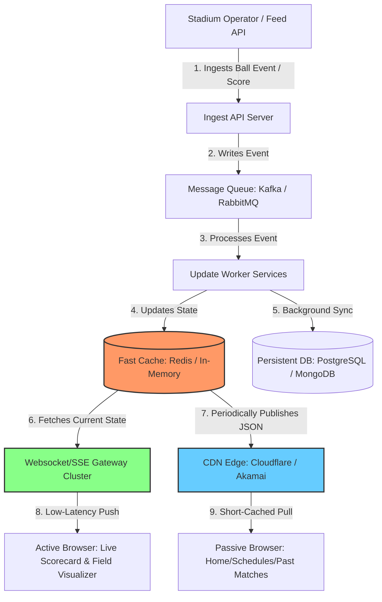
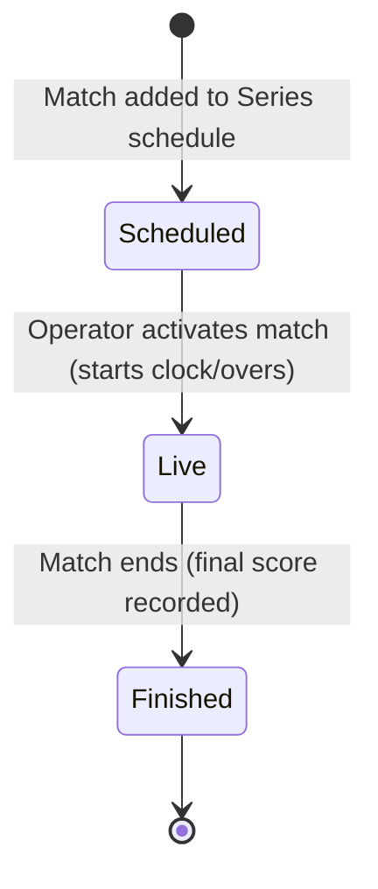

# Real-Time Sports Architecture (Cricbuzz & ESPNcricinfo Style)

This guide breaks down the enterprise-level architecture used by platforms like Cricbuzz and ESPNcricinfo to deliver live sports updates (scores, ball-by-ball commentary, telemetry, and match status transitions) to millions of concurrent users with sub-second latency.

---

## 1. High-Level Architecture Overview

In a production sports tracker website, direct database polling is not feasible because hitting a database (like PostgreSQL or MongoDB) for every client connection would immediately overwhelm the database. Instead, systems use an ingest-push-cache pipeline.

### System Diagram

---

## 2. Key Architecture Columns

### A. Data Ingestion & Scoring Console
*   **Stadium Input**: Human operators at the venue use specialized UI panels (similar to the `AdminSimulator` in your project) or connect to official data feeds (like Opta or Sportradar).
*   **Structured Events**: Every action (e.g., "Over 14.2: Virat Kohli hits a 4") is sent as a small JSON payload to the ingest backend.

### B. Ultra-Low Latency Updates (The WebSocket/SSE Layer)
*   **Persistent Web Channels**: To update browser UI elements without page refreshes, servers maintain persistent TCP channels with clients using **WebSockets** or **Server-Sent Events (SSE)**.
*   **Rooms / Pub-Sub**: Clients subscribe only to the match room they are viewing (e.g., `match:14`). When a change occurs, the socket cluster broadcasts it only to users in that room.
*   *In your workspace:* [server.js](file:///c:/Users/hites/YOUTUBE/Project/Sport/server/server.js#L125-L146) implements this with `socket.join('match:id')` and `io.to('match:id').emit('matchUpdate')`.

### C. Caching Layer (Redis / In-Memory Store)
*   **Sub-millisecond Reads**: Live scores are kept in memory (like a `Map` or Redis). When users load the match dashboard, they fetch directly from the cache.
*   **Write-Back Caching**: Writes are synced to the primary disk database asynchronously (e.g., every 5 seconds) to avoid database write bottlenecks.
*   *In your workspace:* [cache.js](file:///c:/Users/hites/YOUTUBE/Project/Sport/server/cache.js#L4-L107) stores live matches in an in-memory `Map` and flushes updates to PostgreSQL/JSON file using `setInterval` every 5 seconds.

### D. Global Scale via CDN (Content Delivery Networks)
*   For millions of users checking schedules or results, WebSockets can be expensive to scale. 
*   **Edge Caching**: Servers publish live score summaries as lightweight JSON files directly to CDN edges (e.g., Cloudflare) with a time-to-live (TTL) of 1–2 seconds. Passive browsers pull this JSON file instead of making database queries, drastically reducing server costs.

---

## 3. Database & Match Lifecycle Design

To manage upcoming series, live matches, and finished tournaments, the database categorizes matches using a state machine:

### Match Lifecycle States

| Status | Query Focus | Optimization Strategy |
| :--- | :--- | :--- |
| **Scheduled** (Upcoming) | Dates, Series groupings, venues, squad previews | Cached at CDN level (long TTL, e.g., 5-30 minutes). |
| **Live** (Active) | Scores, commentaries, balls, field telemetry | Dynamic WebSocket streaming combined with short-lived in-memory caches. |
| **Finished** (Past) | Full scorecard, match results, tournament standings | Highly static. Cached permanently at CDN level. |

---

## 4. How the Code in Your Workspace Works

Your project contains a fully operational mini version of this enterprise design:

1.  **Ingestion & Control**: The `AdminSimulator.jsx` lets you toggle automatic play or send manual events (runs, wickets, shots, points).
2.  **WebSocket Push Server**: The `server.js` and `simulator.js` files push updates every `X` milliseconds. The client (`MatchDetail.jsx` and `Dashboard.jsx`) receives these and updates the scores instantly.
3.  **Real-Time Biometrics**: Telemetry generator (`generateTelemetry` in `simulator.js`) generates high-frequency player heart rates and field ball positions, rendered on the client canvas with high precision.
4.  **Database Fallbacks**: `db.js` supports PostgreSQL with automatic fallback to local JSON database storage (`sports_tracker_db.json`).

---

## 5. Roadmap to Build a Full Cricbuzz Clone

If you want to scale this workspace into a complete clone, you should implement the following steps:

1.  **Add a Tournament/Series Table**:
    *   Create a schema for Series (e.g., `IPL 2026`, `Ashes 2026`) and link matches to `series_id`.
    *   This lets you group matches on the home screen like Cricbuzz does.
2.  **Filter Tabs on Dashboard**:
    *   Add "Upcoming", "Live", and "Past" tabs to the UI.
    *   Filter the `/api/matches` response based on `status === 'scheduled' | 'live' | 'finished'`.
3.  **Deploy Redis for Caching**:
    *   Replace the in-memory JavaScript `Map` inside `cache.js` with **Redis** to allow multiple Node.js server instances to share match states in production.
4.  **Ball-by-Ball Summary Tab**:
    *   Store a detailed log of every event/commentary in the database so users can scroll back through every ball of the match.
